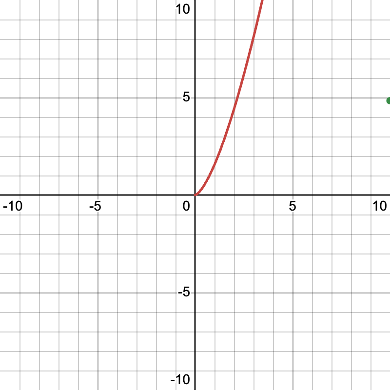

# Algorithm Analysis

## Space Complexity

TODO: In 1-2 sentences, describe the space complexity of your code in terms of the total size of the grid.
    The space complexity of the LetterGrid class is O(n), where n is the total number of characters in the input string. This is because the grid is stored as a 2D vector of characters, requiring a direct linear amount of space relative to the input size.

## Time Complexity

TODO: In 1-2 sentences, describe the time complexity of your code in terms of the total size of the grid.
    The time complexity of getValidSquares() is O(n * sqrt(n)), where n is the total number of characters in the input grid. The function iterates over each character (O(n)) and attempts to form squares of increasing sizes (O(sqrt(n)) in the worst case). This results in an overall complexity of O(n * sqrt(n)).

## Empirical Evidence33

TODO: Save a screenshot of your benchmark graph in `graph.png` and explain in 1-2 sentences how it supports your complexity analysis.
    The benchmark results show a nonlinear increase in execution time as the grid size grows, aligning with the expected O(n * sqrt(n)) complexity. The plotted curve follows the predicted theoretical trend, confirming that as n increases, the runtime scales at a rate greater than O(n) but lower than O(n²), supporting our complexity analysis.